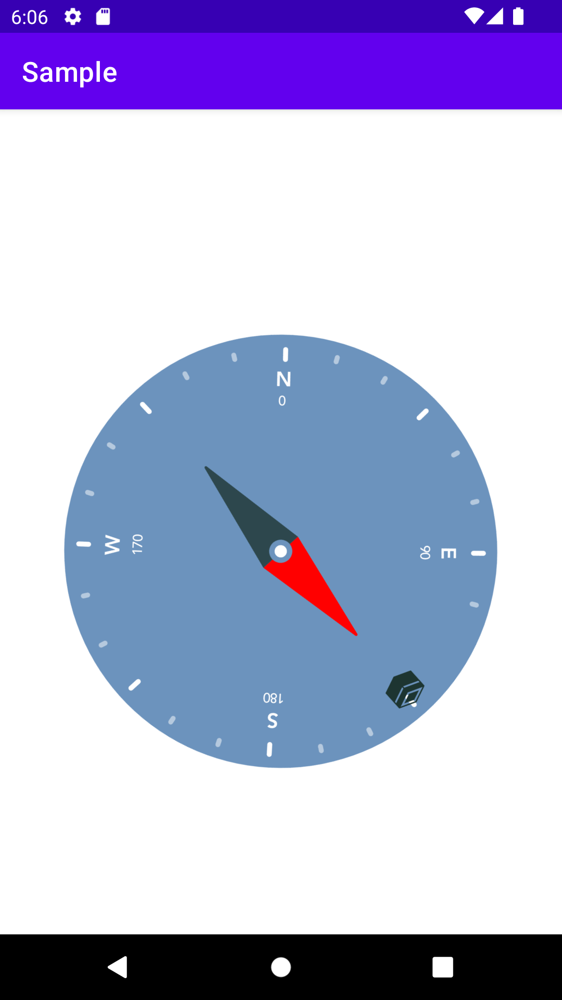

# Android Qibla Finder or Compass
An easy to use and lightweight Android Qibla Finder/Compass library

## Current Version 
[](https://jitpack.io/#imranbaigshortcut/android-qibla-finder)

1.0.4


### How to add in your android project 

##### 1. Add it in your root build.gradle at the end of repositories:
```
  allprojects {
		repositories {
			maven { url 'https://jitpack.io' }
		}
	}
```  
##### 2. Add the dependency app level gradle
```
  dependencies {
	       implementation 'com.github.imranbaigshortcut:android-qibla-finder:1.0.3'
  }
```
  
### How to add QiblaCompassView in the xml layout

Library provides a simple lightweight custom view QiblaCompassView that you can add in your activity or fragment.

```
<com.ib.qiblafinder.view.QiblaCompassView
        android:id="@+id/qiblaCompassView"
        app:dialDrawable="@drawable/ic_dial"
        app:needleDrawable="@drawable/ic_needle"
        app:hideStatusText="false"
        android:layout_width="match_parent"
        android:layout_height="wrap_content"
        />   

```

##### Usage QiblaDegreeListener
With every new location, degree changes 

```
  
qiblaCompassView.degreeListener = object : QiblaDegreeListener {
            override fun onDegreeChange(degree: Float) {
                // Save the degree in your app preference for future initialization 
            }
}
```

##### Usage of location property
Find your current location from location services and provide it to QiblaCompassView for accurate direction finding
```
qiblaCompassView.location = location    
```

##### Usage of degree property
Optionally set the saved degree angle from last time

```
qiblaCompassView.degree = startingDegree 
```
